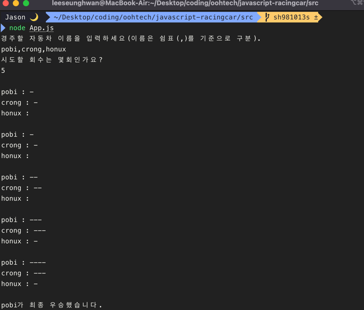

<p align="middle" >
  
</p>
<h2 align="middle">level1 - 자동차 경주 게임</h2>
<p align="middle">자바스크립트로 구현 하는 자동차 경주 게임</p>

## 페어 : 유스, 부엉이

## 중점 구현 사항

1. 도메인 로직과 UI 로직 분리
   - 도메인 로직은 App, Car, CarManager에서 담당
   - UI 로직은 InputView, OutputView에서 담당
   - 유효성 검사 기능을 Validators 에서 담당
2. 도메인 로직에 대한 단위 테스트 구현
   - 모든 도메인 로직에 대해 단위 테스트 구현
   - 테스트하기 용이하도록 코드 리팩토링
   - 유효성 검사 테스트 코드 작성

## 실행 방법

```bash
// 저장소 클론
git clone -b step2 --single-branch https://github.com/suyoungj/javascript-racingcar.git

// 패키지 설치
npm i

// App.js가 존재하는 폴더로 이동
cd ./src

// 애플리케이션 실행
node App.js
```

## 실행 결과



## 디렉터리 구조

```bash
.
├── App.js
├── domain
│   ├── Car.js
│   ├── RacingGame.js
│   └── validators
│       ├── CarNamesInputValidator.js
│       └── TryCountInputValidator.js
│
├── utils
│   ├── Console.js
│   └── RandomNumberGenerator.js
│
└── view
    ├── InputView.js
    └── OutputView.js
```
