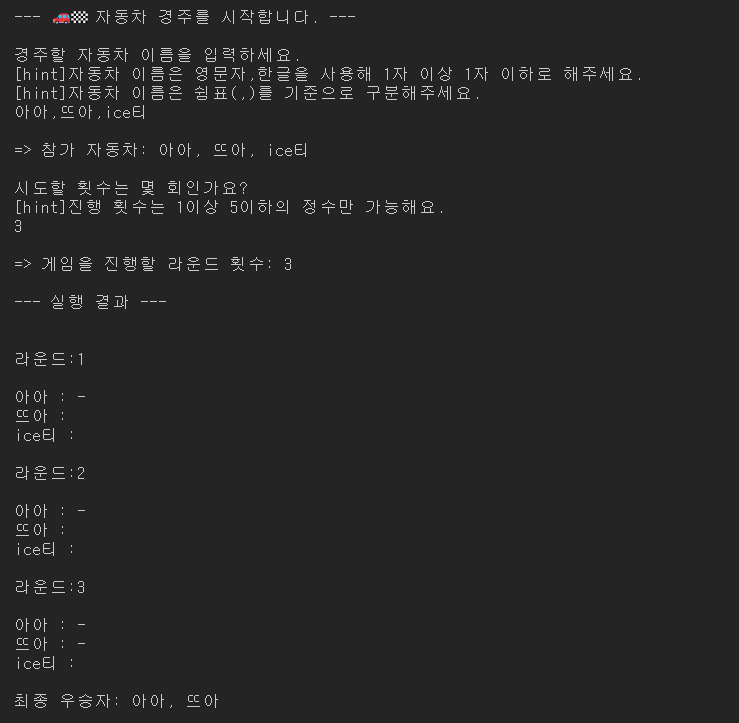

<p align="middle" >
  
</p>
<h2 align="middle">level1 - 자동차 경주 게임</h2>
<p align="middle">자바스크립트로 구현 하는 자동차 경주 게임</p>


### 실행
```bash
node src/index.js
```
### 테스트 
```bash
npm run test
```

### 실행 화면


### 도메인 로직

1. 자동차 이름, 게임 라운드에 대한 유효성 검사
2. 랜덤 숫자 생성
3. 랜덤 숫자에 따른 자동차의 전진,판단
4. 게임 진행 횟수 만큼 자동차 전진 판단 진행
5. 우승자 판단
   
### 파일 구조


<details>
<summary>📜 파일 구조 보기</summary>
<div markdown="1">

```

📦src
 ┣ 📂constant : 상수 관리
 ┃ ┣ 📜index.js
 ┃ ┣ 📜message.js : 입력, 출력 메세지 관리 
 ┃ ┗ 📜rule.js: 게임 룰에 관한 상수 관리
 ┣ 📂controller
 ┃ ┣ 📜Game.js : 게임 진행 관리
 ┃ ┣ 📜index.js
 ┃ ┣ 📜InputController.js : 유효한 입력값을 받을 때 까지 입력값 받기 진행
 ┃ ┗ 📜OutputController.js : 출력할 데이터값을 받아서 UI에 넘겨주는 기능 담당
 ┣ 📂domain : 도메인 로직 관리
 ┣ ┣📂util 
 ┃ ┃ ┗ 📜RandomNumber.js : 랜덤값을 생성하는 유틸
 ┃ ┣ 📜Car.js : 참여하는 자동차에 대한 데이터(이름, 전진 횟수) 관리
 ┃ ┣ 📜CarValidator.js : 자동차에 대한 유효성 검사 담당
 ┃ ┣ 📜index.js
 ┃ ┣ 📜Referee.js : 우승자 판단
 ┃ ┗ 📜Round.js : 게임 진행 횟수에 대한 유효성 검사 및 게임 진행 횟수 데이터 관리
 ┣ 📂views : UI 담당
 ┣ ┣📂util : 
 ┃ ┃ ┗ 📜Console.js: 터미널의 입출력 기능 담당
 ┃ ┣ 📜index.js
 ┃ ┣ 📜InputView.js : 입력 ui 담당
 ┃ ┗ 📜OutView.js : 출력 ui 담당
 ┣ 📜App.js
 ┗ 📜index.js

📦testUtils : 입출력과 랜덤값을 임의로 설정해 확인할 수 있는 테스트 유틸
 ┣ 📂__tests__
 ┃ ┗ 📜Util.test.js : 테스트 유틸에 대한 테스트 파일
 ┗ 📜index.js : 테스트 유틸 관리 파일

 📦__tests__
 ┣ 📜.gitkeep
 ┣ 📜Application.test.js : 자동차 경주 게임의 전반적인 실행에 대한 테스트
 ┣ 📜Car.test.js : 자동차의 전진 판단에 대한 테스트
 ┣ 📜CarValidator.test.js : 자동차 유효성 검사에 대한 테스트
 ┣ 📜RandomNumber.test.js : 랜덤 숫자에 대한 테스트
 ┗ 📜RoundValidator.test.js : 게임 라운드에 대한 유효성 검사에 대한 테스트

```
</div>
</details>
