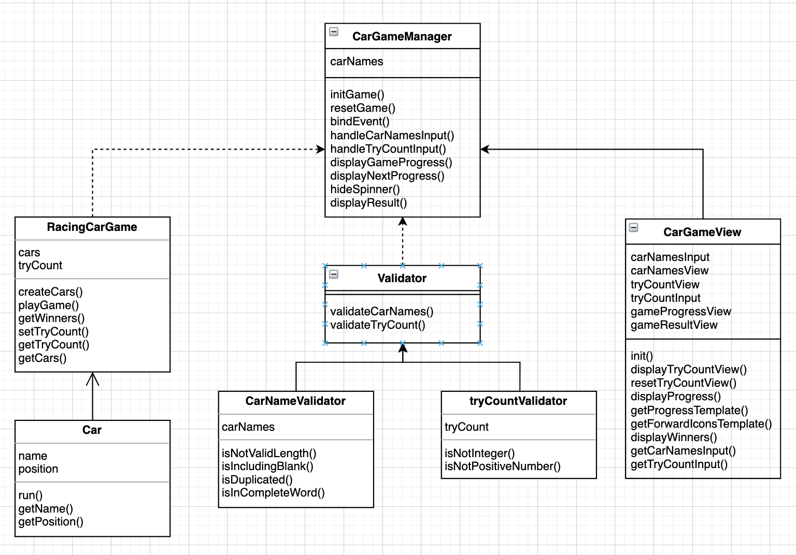

<p align="middle" >
  
</p>
<h2 align="middle">level1 - 자동차 경주 게임</h2>
<p align="middle">자바스크립트로 구현 하는 자동차 경주 게임</p>
<p align="middle">


<a href="https://github.com/daybrush/moveable/blob/master/LICENSE" target="_blank">
  
  </a>
</p>

## 🔥 Projects!

<p align="middle">
  
</p>

## 데모 페이지

-[자동차 경주 게임](https://sunhpark42.github.io/javascript-racingcar/)

### 📝 앱 구조도

<p align="middle">
  
</p>

### 📝 컴포넌트 구조

<p align="middle">
  
</p>

### 📂 디렉토리 구조

```
src/js
  ├── Constants/
  │   └── constants.js
  ├── Game/
  │   ├── Car.js
  │   └── RacingCarGame.js
  ├── CarGameManager.js
  ├── CarGameView.js
  ├── index.js
  └── utils.js
```

## 과제 요구사항

### 🎯 step1

- [x] 주어진 횟수 동안 n대의 자동차는 전진 또는 멈출 수 있다.
- [x] 자동차에 이름을 부여할 수 있다. 전진하는 자동차를 출력할 때 자동차 이름을 같이 출력한다.
- [x] 자동차 이름은 쉼표(,)를 기준으로 구분하며 이름은 5자 이하만 가능하다.
- [x] 사용자는 몇 번의 이동을 할 것인지를 입력할 수 있어야 한다.
- [x] 전진하는 조건은 0에서 9 사이에서 random 값을 구한 후 random 값이 4 이상일 경우 전진하고, 3 이하의 값이면 멈춘다.
- [x] 자동차 경주 게임을 완료한 후 누가 우승했는지를 알려준다. 우승자는 한 명 이상일 수 있다.
- [x] 우승자가 여러명일 경우 ,를 이용하여 구분한다.

### 🎯🎯 step2

- [x] 자동차 경주 게임의 턴이 진행 될 때마다 1초의 텀(progressive 재생)을 두고 진행한다.
  - [x] 애니메이션 구현을 위해 setInterval, setTimeout, requestAnimationFrame 을 활용한다.
- [x] 정상적으로 게임의 턴이 다 동작된 후에는 결과를 보여주고, 2초 후에 축하의 alert 메세지를 띄운다.
- [x] 위 기능들이 정상적으로 동작하는지 Cypress를 이용해 테스트한다.

### BDD

- 정상동작

  - [x] 사용자는 페이지에 들어오면 자동차 이름을 입력하는 폼을 본다.
  - [x] 자동차 이름을 입력하는 칸에 자동차 이름을 입력한다.
  - [x] 사용자는 확인 버튼을 누르고 시도할 횟수를 입력하는 폼을 본다.
  - [x] 사용자는 시도할 횟수를 입력한다.
        <step1>
    - [x] 사용자는 확인 버튼을 누르고 결과 화면을 본다 (진행결과, 최종 우승자, 다시시작하기 버튼)
          <step2>
    - [x] 사용자는 확인 버튼을 누르고 진행 화면에 로딩(스피너)가 1초간 돌아가는 것을 본다.
    - [x] 스피너가 나타난지 1초 이후 약 1초 간격으로 게임 진행을 화살표를 이용해서 보여준다.
      - 진행하지 않고, 턴이 남아있을 경우 화살표 다음에 스피너가 보여진다.
    - [x] 사용자는 턴이 종료 되면 전체 과정과 최종우승자와 다시시작하기 버튼을 본다.
    - [x] 2초후 축하 메세지가 alert 로 나타난다. - 축하 메세지에 우승자를 표시한다.
  - [x] 사용자는 다시 시작버튼을 누른다. & 사용자는 게임의 첫 화면으로 돌아간다. ( 시도횟수, 결과 화면이 사라진다. )

- 예외상황
  - 자동차 이름
    - [x] 자동차 이름이 5자를 초과하거나, 1글자 미만인 경우 ⇒ Error
    - [x] 자동차 이름이 중복되는 경우
      - Error
      - ~~뒤에 숫자를 넣어주는 식으로 구분.~~
      - 대소문자 구분 함.
    - [x] 완전한 한글자가 아닌경우 (ex. ㅏ ㄱ ㄷ) ⇒ Error
      - 한글, 영어, 숫자만 허용함.
    - [x] 자동차 이름에 공백이 있는 경우 ⇒ Error
  - 시도횟수
    - [x] 입력된 값이 정수가 아닌 경우
    - [x] 입력된 값이 0이하인 경우
      - input tag 에 min 값을 추가하여, 0 이하인 경우는 입력할 수 없게 함.
      - 사용자가 직접 입력하는 경우, 여전히 발생할 수 있는 에러이므로 에러 메세지는 남겨두었음.

### 구현할 기능 상세 (Step2)

- [x] 확인 버튼 클릭 이후 1초간 지연
- [x] 1초 단위로 한 단계의 게임을 시작
- [x] 턴이 끝났는지 확인한 후 결과 내보내기
- [x] 결과창이 나온 후 2초 뒤 alert 띄우기

### 추가 기능

- [x] autofocus 추가하기
  - [x] 페이지에 들어오면 자동차 이름 입력을 받는 Input 에 focus
  - [x] 자동차 이름 입력 확인 버튼을 누르면, 시도 횟수 Input 에 focus
- [x] 시도 횟수 입력을 받은이후 확인, Input disabled 로 바꾸기
      : 다시 시작 버튼이 존재 하는데, 현재 확인 버튼을 눌러 값을 바꾸면, 게임을 다시 시작하는 것과 같아서
      : 게임이 시작 된 이후로 값을 변경하지 못하게 하기 위함.
      : 단, 자동차 이름은 시도횟수를 입력하기 전 까지 변경할 수 있다. (시도 횟수를 누르기 전에는 게임이 시작되지 않으므로)

## 📝 License

This project is [MIT](https://github.com/woowacourse/javascript-racingcar/blob/main/LICENSE) licensed.
