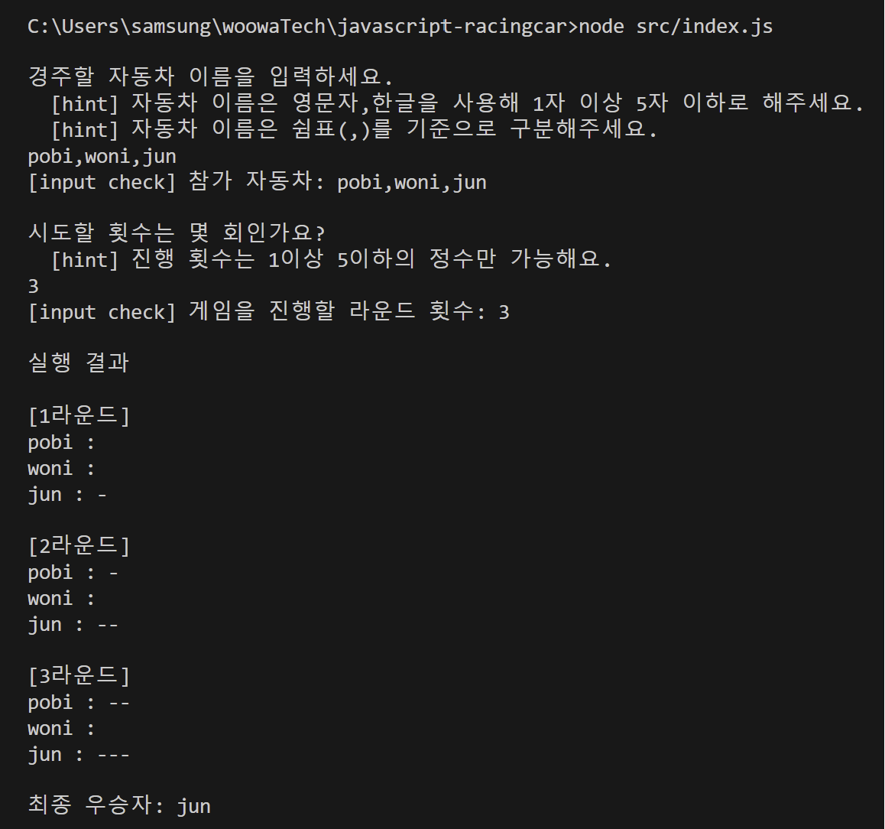

<p align="middle" >
  
</p>
<h2 align="middle">level1 - 자동차 경주 게임</h2>
<p align="middle">자바스크립트로 구현 하는 자동차 경주 게임</p>

### 실행

```bash
node src/index.js
```

### 테스트

```bash
npm run test
```

### 실행 화면



### 도메인 로직

1. 유효성 검사
2. 랜덤 숫자 생성
3. 랜덤 숫자에 따른 자동차의 전진,판단
4. 게임 진행 횟수 만큼 자동차 전진 판단 진행
5. 우승자 판단

### 파일 구조

<details>
<summary>📜 파일 구조 보기</summary>
<div markdown="1">

```

📦src
 ┣ 📂constants : 상수 관리
 ┃ ┣ 📜index.js
 ┃ ┗ 📜Message.js : 입력, 출력 메세지 관리
 ┣ 📂controllers
 ┃ ┣ 📜Game.js : 게임 진행 관리
 ┃ ┣ 📜index.js
 ┃ ┗ 📜InputController.js : 유효한 입력값을 받을 때 까지 입력값 받기 진행
 ┣ 📂domain
 ┃ ┣ 📜Car.js : 참여하는 자동차에 대한 데이터(이름, 전진 횟수) 관리
 ┃ ┣ 📜CarValidator.js : 자동차에 대한 유효성 검사 담당
 ┃ ┣ 📜index.js
 ┃ ┗ 📜RoundValidator.js : 게임 진행 횟수에 대한 유효성 검사 담당
 ┣ 📂utils
 ┃ ┣ 📜Console.js : 터미널로 입출력하는 유틸
 ┃ ┣ 📜index.js
 ┃ ┗ 📜RandomNumber.js : 랜덤값을 생성하는 유틸
 ┣ 📂view
 ┃ ┣ 📜index.js
 ┃ ┣ 📜InputView.js : 입력 ui 담당
 ┃ ┗ 📜OutView.js : 출력 ui 담당
 ┣ 📜App.js
 ┗ 📜index.js


🔎 Game 에 대한 추가 설명
- 유효성 검사 통과한 입력값에 대해 참여하는 자동차 리스트, 게임 진행 횟수를 설정
- 게임 진행 횟수 만큼 자동차 전진 판단 실행
- 우승자 판단 및 출력

📦testUtils : 입출력과 랜덤값을 임의로 설정해 확인할 수 있는 테스트 유틸
 ┣ 📂__tests__
 ┃ ┗ 📜Util.test.js : 테스트 유틸에 대한 테스트 파일
 ┗ 📜index.js : 테스트 유틸 관리 파일

 📦__tests__
 ┣ 📜.gitkeep
 ┣ 📜Application.test.js : 자동차 경주 게임의 전반적인 실행에 대한 테스트
 ┣ 📜Car.test.js : 자동차의 전진 판단에 대한 테스트
 ┣ 📜RandomNumber.test.js : 랜덤 숫자에 대한 테스트
 ┗ 📜Validator.test.js : 유효성 검사에 대한 테스트

```

</div>
</details>
