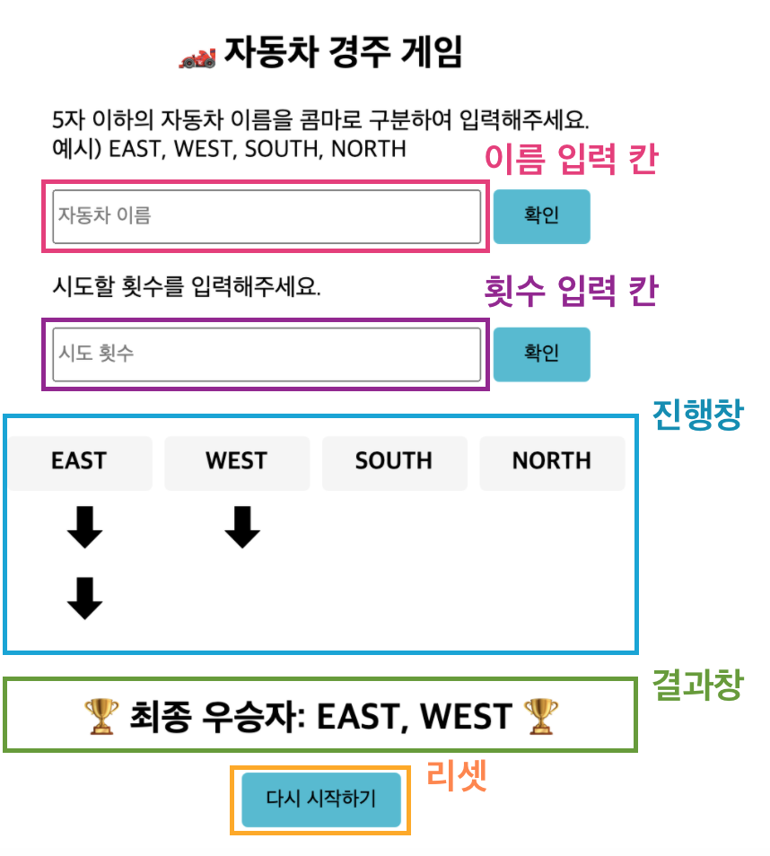

<p align="middle" >
  
</p>
<h2 align="middle">level1 - 자동차 경주 게임</h2>
<p align="middle">자바스크립트로 구현 하는 자동차 경주 게임</p>
<p align="middle">


<a href="https://github.com/daybrush/moveable/blob/master/LICENSE" target="_blank">
  
  </a>
</p>

## 🔥 Projects!

<p align="middle">
  
</p>

### :point_right: commit principle

- :hammer_and_wrench: `:hammer_and_wrench:`when refactoring the code
- :racehorse: `:racehorse:` when adding the function or something
- :memo: `:memo:` when writing docs
- :bug: `:bug:` when fixing a bug
- :fire: `:fire:` when removing code or files
- :white_check_mark: `:white_check_mark:` when adding tests
- :ballot_box_with_check: `:ballot_box_with_check:` when resolving tests
- :shirt: `:shirt:` when removing linter warnings
- :beginner: `:beginner:` when inital commit

### :technologist: feat list



#### major feature

- [x] 이름 입력 칸과 확인 버튼만 있다.
- [x] 이름 입력 칸에 placeholder('자동차 이름')가 있다.
- [x] 이름 입력 칸에 ','로 구분해서 이름을 입력할 수 있다. (TDD)
- [x] 이름 입력 칸에 이름을 입력하고 확인 버튼을 누르면 칸이 비워지고, 횟수 입력 칸이 나온다.
- [x] 이름 입력 칸은 알파벳, 한글, ‘,’만 입력 가능하다.
- [x] 횟수 입력 칸에 placeholder('시도 횟수')가 있다.
- [x] 횟수 입력 칸에 횟수를 입력하고 확인 버튼을 누르면 칸이 비워진다.
- [x] 횟수 입력 칸에 횟수를 입력하고 확인 버튼을 누르면 진행창/결과창/리셋 버튼이 나온다.
- [x] 이름 확인 버튼을 연달아 눌러도 횟수 입력 칸과 버튼은 한 번만 나온다.
- [ ] 횟수 확인 버튼을 연달아 눌러도 진행창/결과창/리셋 버튼은 한 번만 나온다.
- [ ] 입력한 이름이 ‘,’를 기준으로 진행창에 출력된다.
- [ ] 입력한 횟수만큼 진행창에서 게임이 시도된다.
- [ ] 랜덤한 숫자를 생성한다. (TDD)
- [ ] 각 자동차에 랜덤 값을 부여한다. (TDD)
- [ ] 랜덤 값이 4-9일 때 전진, 0-3일 때 멈춘다. (TDD)
- [ ] 가장 많이 전진한 자동차가 우승인지 판별한다. (TDD)
- [ ] 우승자를 출력한다. (TDD)
- [ ] 각 자동차의 최대 전진 횟수가 입력한 횟수보다 적거나 같다. (TDD)
- [ ] 우승자가 2명 이상일 경우 ‘,’로 구분하여 출력한다. (TDD)
- [ ] 우승자의 수는 입력한 이름의 수보다 적거나 같다. (TDD)
- [ ] 리셋 버튼을 누르면 초기 상태로 돌아간다.

#### exceptions

- [ ] 빈 문자인 이름을 등록하면 alert 메시지를 표시한다.
- [ ] 5자 초과인 이름을 등록하면 alert 메시지를 표시한다.
- [ ] 이름을 등록한 뒤에 다시 이름을 등록하려 할 경우 alert 메시지를 표시한다.
- [ ] 횟수를 설정한 뒤에 다시 횟수를 설정하려 할 경우 alert 메시지를 표시한다.
- [ ] 횟수를 설정하려 할 때 횟수가 자연수가 아닐 경우 alert 메시지를 표시한다.
- [ ] 시도할 횟수 입력 칸에 문자, 0, 기호를 입력할 경우 alert 메시지를 표시한다.

### 🎯 step1

- [ ] 주어진 횟수 동안 n대의 자동차는 전진 또는 멈출 수 있다.
- [ ] 자동차에 이름을 부여할 수 있다. 전진하는 자동차를 출력할 때 자동차 이름을 같이 출력한다.
- [ ] 자동차 이름은 쉼표(,)를 기준으로 구분하며 이름은 5자 이하만 가능하다.
- [ ] 사용자는 몇 번의 이동을 할 것인지를 입력할 수 있어야 한다.
- [ ] 전진하는 조건은 0에서 9 사이에서 random 값을 구한 후 random 값이 4 이상일 경우 전진하고, 3 이하의 값이면 멈춘다.
- [ ] 자동차 경주 게임을 완료한 후 누가 우승했는지를 알려준다. 우승자는 한 명 이상일 수 있다.
- [ ] 우승자가 여러명일 경우 ,를 이용하여 구분한다.

### 🎯🎯 step2

- [ ] 자동차 경주 게임의 턴이 진행 될 때마다 1초의 텀(progressive 재생)을 두고 진행한다.
  - [ ] 애니메이션 구현을 위해 setInterval, setTimeout, requestAnimationFrame 을 활용한다.
- [ ] 정상적으로 게임의 턴이 다 동작된 후에는 결과를 보여주고, 2초 후에 축하의 alert 메세지를 띄운다.
- [ ] 위 기능들이 정상적으로 동작하는지 Cypress를 이용해 테스트한다.

<br>

## ⚙️ Before Started

####  로컬에서 서버 띄워서 손쉽게 static resources 변경 및 확인하는 방법

로컬에서 웹서버를 띄워 html, css, js 등을 실시간으로 손쉽게 테스트해 볼 수 있습니다. 이를 위해서는 우선 npm이 설치되어 있어야 합니다. 구글에 `npm install` 이란 키워드로 각자의 운영체제에 맞게끔 npm을 설치해주세요. 이후 아래의 명령어를 통해 실시간으로 웹페이지를 테스트해볼 수 있습니다.

```
npm install -g live-server
```

실행은 아래의 커맨드로 할 수 있습니다.

```
live-server 폴더명
```

<br>

## 👏 Contributing

만약 미션 수행 중에 개선사항이 보인다면, 언제든 자유롭게 PR을 보내주세요.

<br>

## 🐞 Bug Report

버그를 발견한다면, [Issues](https://github.com/woowacourse/javascript-racingcar/issues) 에 등록 후 @eastjun에게 dm을 보내주세요.

<br>

## 📝 License

This project is [MIT](https://github.com/woowacourse/javascript-racingcar/blob/main/LICENSE) licensed.
